# BYU CTF April 2023 Forensic Section Writeup

## Table of Contents
* [Overview](#overview)
* [Challenge 1](#challenge-1)
* [Challenge 2](#challenge-2)
* [Challenge 3](#challenge-3)
* [Challenge 4](#challenge-4)
* [Challenge 5](#challenge-5)
* [Challenge 6](#challenge-6)

---

## Overview

The forensic challenges follow a story: a secret agent is deployed to investigate the possibility of a mole, during which time their laptop is compromised. The investigator takes the role of the secret agent and tries to determine certain information about the incident.

All answers should be case insensitive if possible, since I do not care if the challenger correctly types .PDF of .pdf, etc. Different tools sometimes use different capitalization, so this keeps it fair for everyone.

The zip file 'full.zip' contains all the questions, answers, and hints for each challenge, as well as the evidence needed for each challenge. The zip file 'evidence.zip' only contains the artifacts needed for each challenge with no other documents. 

Challenge questions, answers, hints, and walkthroughs are also included here. Note that there are multiple ways to solve many of these, especially when working with Linux/MacOS vs Windows. These solutions are all given from the perspective of a Windows machine.

I also included recommended difficulty levels on each challenge. I don't really love difficulty ratings, as what is hard for one person might be easy for another. It tends to make people discouraged. The challenges are in order of difficulty already, so feel free to exclude the difficulty ratings. Definitely do NOT label them as "easy", "medium", and "hard". Nothing leads to more discouragement than failing an "easy" challenge.

---

## Challenge 1

### Difficulty: 1

### Question

1:00 AM. The rest of the hotel is asleep right now, save a handful of the hotel staff. And you. Earlier that day, you went to the hotel front desk to complain about the internet to your room suddenly stopping. They told you to wait in the lobby while they fixed it. This solution might be acceptable to the average guest, but not to you. You are a member of the top-secret S.E.N.T.I.N.E.L. team, after all. Accidents don't happen to you. As you leave the lobby, the front desk insists that you stay. It will be just a minute, they say. But a minute is 60 seconds too long. As you enter your room, you see a man quickly pull his hands off your computer keyboard. He mumbles an apology as he brushes past you. You have spent the last several hours diving into your computer. What has changed? Finally, you notice it. Your mission orders are different. The change is subtle, but important. You have been compromised.
What is the username of the last person to save Mission Orders.docx? Give the answer as:
byuctf{author_name}

Note: this story isn't too far from a real happening. You can read about the creator of Mimikatz and some of the ways foreign intelligence agencies tried to steal his code before he released it publicly. 
https://www.wired.com/story/how-mimikatz-became-go-to-hacker-tool/

Note 2: this forensic investigation is very similar to how security firms determined that Russian Intelligence was likely behind the 2016 Democratic National Convention hack.
https://arstechnica.com/information-technology/2016/06/guccifer-leak-of-dnc-trump-research-has-a-russians-fingerprints-on-it/

### Hint

File systems carry metadata. I wonder if some types of files carry their own internal metadata as well?

### Answer

byuctf{IronSerpent13}

### Walkthrough

This challenge deals with document metadata. Anyone could solve this on any device using the free program 'Exiftool'. Another way to do this is to use the built-in metadata extraction that certain operating systems have when Microsoft Office is installed. Both methods are straightforward, but here is what it looks like from a right-click "properties" view.

First, right-click the file and select "Properties".

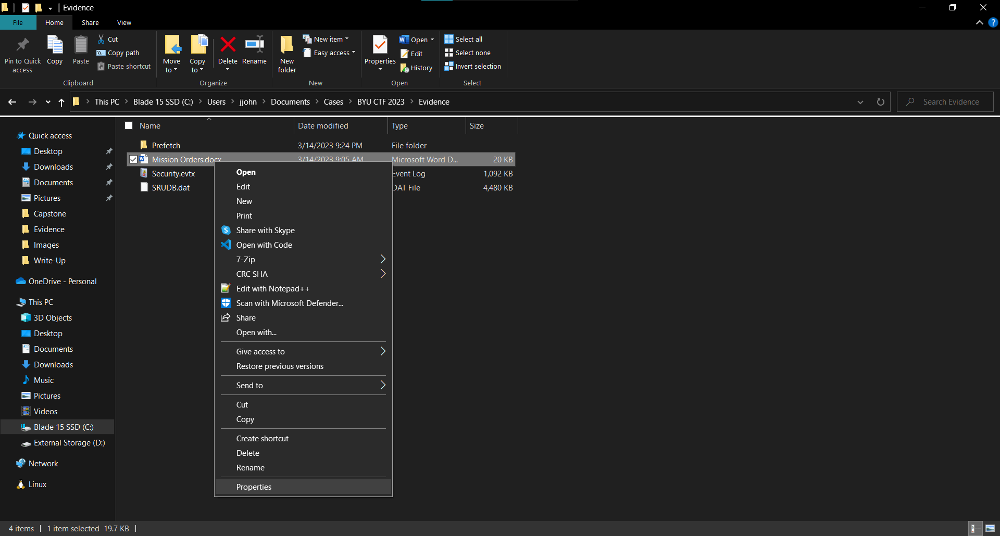

Then go to the "Details" pane. The Author and Last saved by user are different.

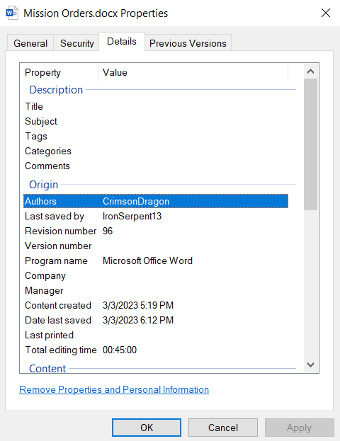

---

## Challenge 2

### Difficulty: 1

### Question

Your hunt begins in earnest now. Now that you know the username of the last person to modify your mission orders, you begin to fear the worst. What else do they know? Is your mission compromised? As you continue searching your computer, you notice a file in your Pictures folder with a recently created timestamp. Interesting. You open it, but it tells you that the file type is invalid. Whatever this is, it isn't a PNG. What is most likely the original file extension for this photo? Assume that the original extension matches the actual file type for flowers.png. Give the answer as:
byuctf{.ext} (where .ext would be .docx for a Word document, .jpg for a JPG, etc.)

Note: changing file extensions to try to obfuscate files is such a common anti-forensic/hacking technique that almost every major forensic suite has processing options to look for this. The option is in X-Ways, Magnet AXIOM, FTK, etc. (Autopsy can do it with a module). This is especially done when exfiltrating files, as it is one way to try to hide data as you pull it out of a system.

### Hint

What is a file signature, and how could you read it?

### Answer

byuctf{.pdf}

### Walkthrough

Files contain binary file headers at the beginning of each file that tell the OS what type of file they are. There are lots of ways to discover this information. Exiftool will again help with this. Someone could also use the `file` command in Linux to find this information easily. The following picture shows what the output would look like if run from Exiftool (note that Exiftool doesn't even listen to the file extension: it just uses the file signature to discover file metadata. Windows tries to use the file extension and fails to discover internal data).

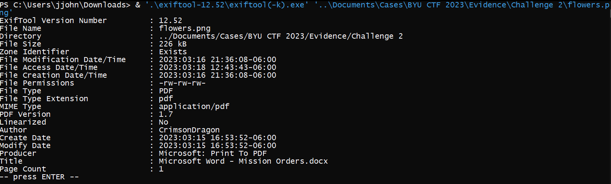

---

## Challenge 3

### Difficulty: 1

### Question

You suspect that the mission orders document may have been altered on another computer and then redownloaded onto the SENTINEL Windows machine. What is the name of the alternate data stream that could tell us if the file was downloaded from the internet? Give the answer as:
byuctf{name_of_alternate_data_stream}

### Hint

Hint: Get in the ZONE.

### Answer

byuctf{Zone.Identifier}

### Walkthrough

No fancy business here. To solve this, just Google until the right answer is discovered. The answer to this question depends on the OS, hence the specification that the SENTINEL machine runs Windows.

---

## Challenge 4

### Difficulty: 2

### Question

It has been several weeks since the hotel incident, and you were fairly confident that you had sanitized your machine. No malware to be found. You aren't so confident anymore. In your logs, you can see indication that your user - CrimsonDragon - ran SDelete on your computer. The process lists you as the creator, and all signs point to your user running the software. But you never ran SDelete. Your login screen is locked behind a key card and face recognition software, so you know that someone wasn't signed in as you during that time. They could have signed in as themselves, however, and then called a process using your username and password. What user was actually signed into the computer on 3/14/2023 around 8-9 PM? Give the answer as:
byuctf{username}

WARNING: this challenge will be difficult to do without a Windows machine. Unfortunately, digital forensics can be pretty picky that way. If you need to view the event log with Linux, I would recommend looking at some of the options here: https://www.reddit.com/r/linuxadmin/comments/btnuiz/how_do_you_view_windows_event_viewer_in_linux/

### Hint

The user probably used the RUNAS feature to run SDelete as your user. Are there any event logs that indicate this activity was going on? Alternatively, are there any event logs that indicate interactive logins around this time?

### Answer

byuctf{ShadowHawk}

### Walkthrough

This is a standard Windows Event Log analysis. There are two ways to solve this: look for the 4648 event that shows the ShadowHawk user trying to run a program under the CrimsonDragon context, or look for 4624 and 4625 events, logon type 2. Note that using RUNAS will also create a 4624 logon type 2 event for the user that ran the software (CrimsonDragon), but the fact that the subject account name is "ShadowHawk" instead of "SYSTEM" clues us to the fact that this was not a true interactive login. The following shows how to do this with the Windows Event Viewer, searching for logon/logoff events rather than looking for the RUNAS event (I would recommend searching for 4648 in the real world, but this is probably more likely for someone who isn't familiar with this kind of search):

First, open the log in the Event Viewer and apply a filter.

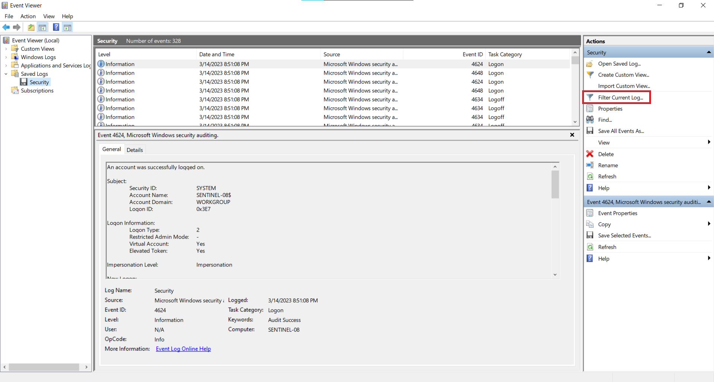

Then search for logon and logoff events.

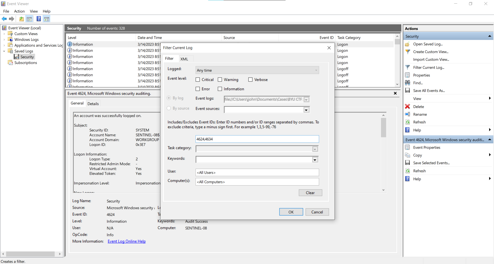

One of the events with a Logon Type 2 shows that ShadowHawk signed into the machine around 8:45 PM.

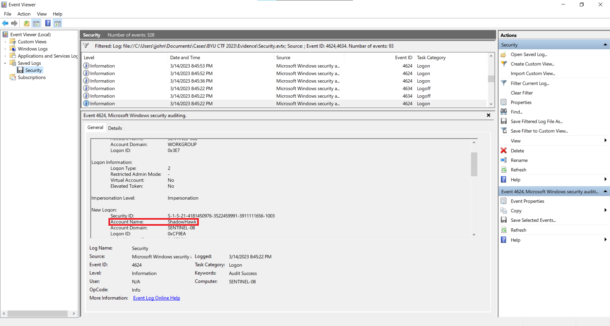

---

## Challenge 5

### Difficulty: 2

### Question

It's time to get to the bottom of this. An enemy agent has infiltrated your machine at least twice, and H.Q. wants answers NOW. The first thing they want to know is what file was deleted by SDelete. What is the name of the text file that SDelete purged from your machine? Give the answer as:
byuctf{name_of_file.txt}

WARNING: This is very difficult to do without Windows. There is an author who makes a Python-friendly package that works with the files we are going to be analyzing, so I created a tool that works in Python and can run on any platform. Since it would be unfair to just give this to everyone, I have locked it in a zip file behind a password. The password is the last name of the author of the free tool that would help solve this challenge on Windows.

### Hint

EZ Tools PECmd

### Answer

byuctf{NICE_TRY_SDELETE.TXT}

### Walkthrough

The software that I provided is locked behind a zip file with the password "Zimmerman". Eric Zimmerman is a big name in digital forensics, so I would highly recommend that anyone wanting to get into Windows forensics should get to know his tools. I will show how to solve this with the PECmd tool from his toolset. My program does a very crappy job emulating some of the functionality that his provides. My tool is written using the 2021 version of the provided software (not the 2022 version), which should hopefully not be too big of a problem.

Note that tools such as Nirsoft's WinPrefetchView do *not* provide enough information to solve this challenge: we need something that pulls referenced file names. WinPrefetchView is a great tool, but it only shows timestamps.

First, the user has to determine that they care only about the SDELETE prefetch file. SDelete is a free utility used to securely delete data by writing over it in many passes. The command that they would use with PECmd would look something like this:

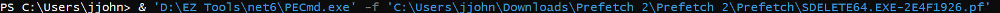

They would then get the following output:

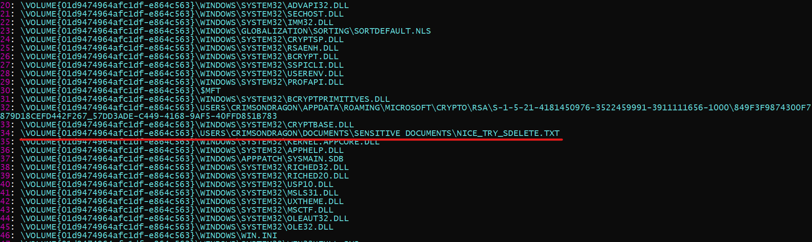

Note that our text file is hiding in the middle. Someone could also take advantage of the keywords function in PECmd to search specifically for .txt files. My knockoff program does not carry that functionality.

---

## Challenge 6

### Difficulty: 3

### Question

Gathering all the evidence you have found so far, you are ready to submit your report to H.Q. Only one question remains: what is the name of the malware that the attacker used to exfiltrate data from your machine? Give the answer as:
byuctf{malware.exe}

WARNING: This is very difficult to do without Windows. I didn't have time to code up a tool to do this for you, so you are on your own if you try on Linux or MacOS. You could probably do something with https://github.com/libyal/libesedb. Good luck.

### Hint

The malware would probably have a lot of network traffic associated with it, especially going outbound. I wonder if SRUM tracks that kind of information...

### Answer

byuctf{nohidingfromsrum.exe}

### Walkthrough

SRUM (System Resource Usage Monitor) is an extremely useful database for hunting malware. To the curious, I highly recommend investigating its uses. The solution starts by analyzing the SRUM database. It is an ESE database, but the Zimmerman toolset already has a tool that analyzes it for us. After processing the file, the database can then be viewed in a CSV format.

Note that in real life, pulling a live SRUDB.dat database off of a computer leaves it in a dirty state: it hasn't written all the data stored in logfiles to the database. Since this is a pretty advanced topic and I don't expect most people to know about this, I went ahead and used some built-in Windows tools to clean the database for the challengers. They shouldn't get any errors trying to use the tools, but let me know if anyone gets an error along the lines of "Object reference not set to an instance of an object" when trying to analyze the file. More info on that topic is found here: https://github.com/EricZimmerman/Srum#repairing-the-srudbdat

To analyze the SRUM database using SrumECmd (part of the Zimmerman toolset), first run a command like the following:

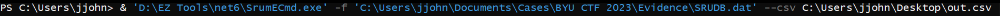

The results should look something like this:

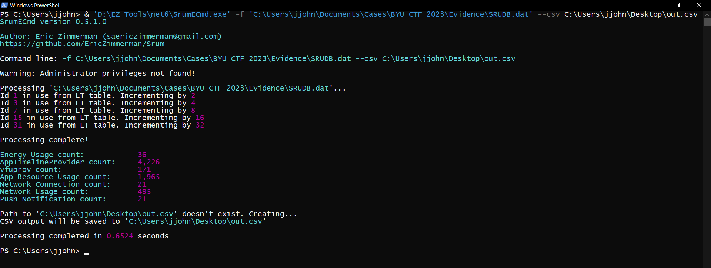

Note that, unlike PECmd, SrumECmd needs to write its output to a CSV file. The list of my CSV files were as follows (each file corresponds to a different SRUM table):

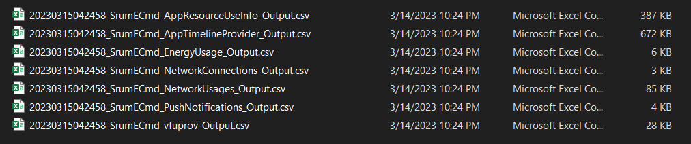

The file/table we care about is the "NetworkUsages" file. The others have uses, but this is the one that holds the answer to our question. Opening the file will look something like this:

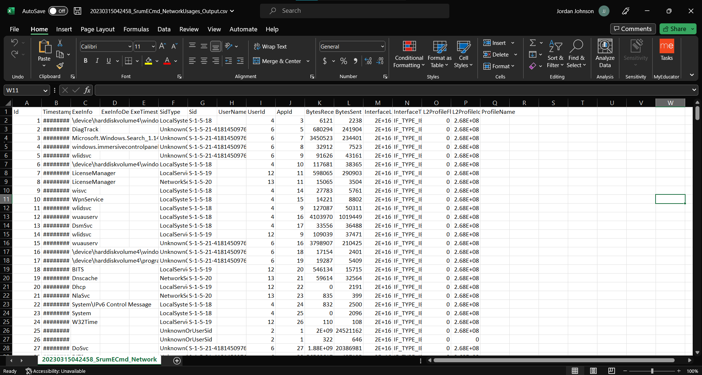

The easiest way to work with this data is to turn it into a table and then sort by BytesSent.

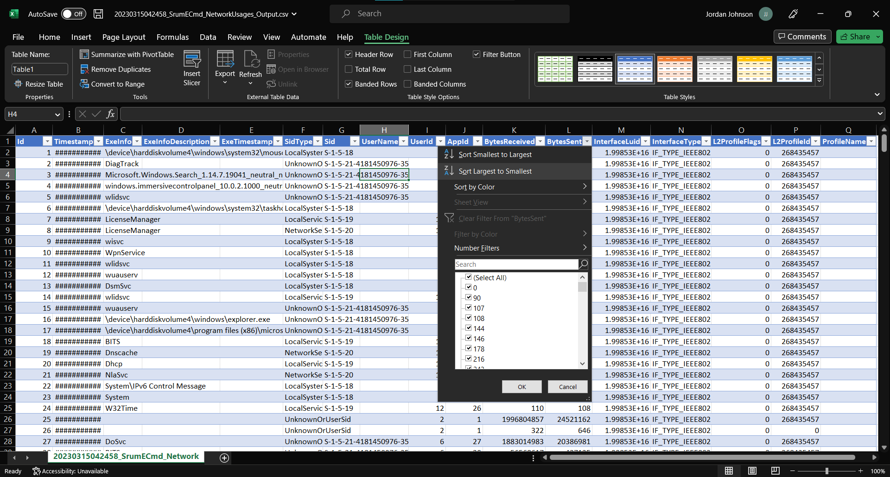

We can then see that the file "nohidingfromsrum.exe" has a lot of network usage going outbound. This is our malware. (In real life, this would just be a good place to start. Most computers have things like VPN software, Slack/Teams, Outlook, etc. that send a lot of data as well.)

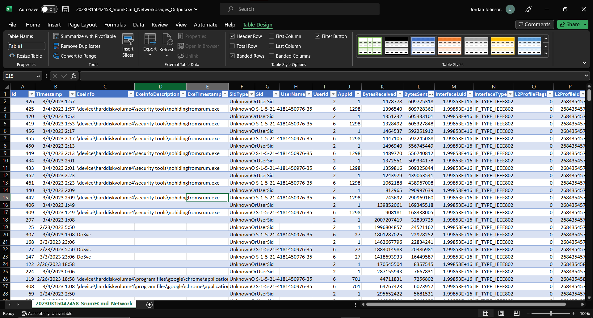