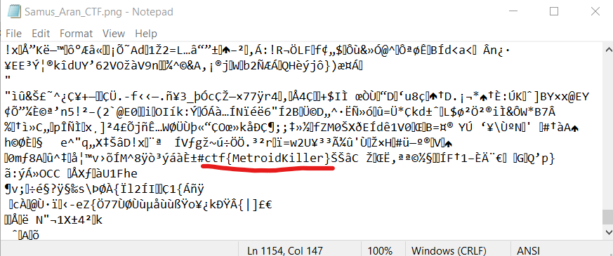

# Samus
**Level**: Easy

**Points**: 379

**Author**: Justin Giboney

**Description**:
```markdown
Can you find our hidden message?

[Samus_Aran_CTF.png]
```

## Writeup
The flag was hidden in the middle of the photo. Since the photo was so big, it would be possible to find it by simply looking at the text in Notepad. However, using `strings` in Linux or `CTRL+F` in Notepad would be more efficient.



**Flag** - `ctf{MetroidKiller}`