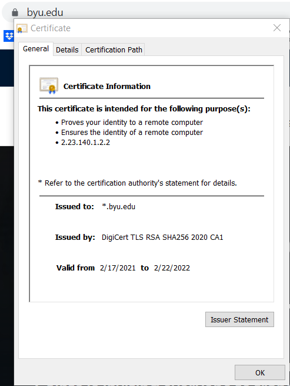

# Because Your Urlisvalid
**Level**: Easy

**Points**: 292

**Author**: Ian Cook

**Description**:
```markdown
Give the expiration date for the cert and name of the CA for byu.edu.

Flag format - `ctf{MM-DD-YYYY-CA}`
```

## Writeup
Inspecting the SSL/TLS certificate on [byu.edu](https://www.byu.edu) will give you the answers needed.



**Flag** - `ctf{02-22-2022-DigiCert}`