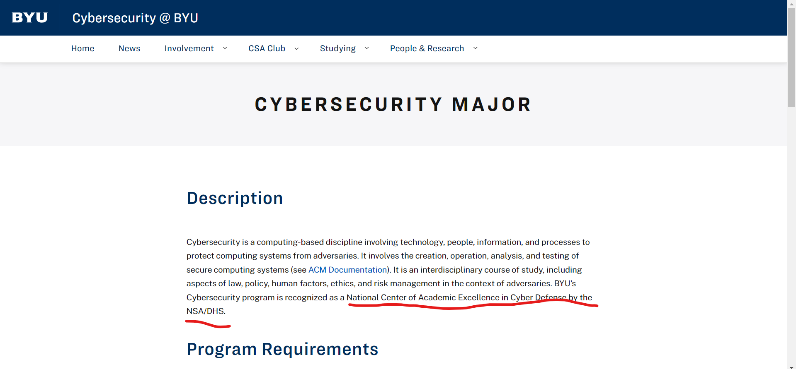

# Certified Legitness
**Level**: Easy

**Points**: 359

**Author**: Ian Cook

**Description**:
```
BYU Cybersecurity Program is a certified ______ by the _____ (check the BYU Cybersecurity website).

Flag format - `ctf{recognitionlevel_org}` (case insensitive) and no spaces.

For example, `ctf{advancedschool_china}` if BYU is a certified advanced school by China.
```

## Writeup
The answer can be found on the [BYU Cybersecurity Major website](https://cybersecurity.byu.edu/cybersecurity-major).



**Flag** - `ctf{nationalcenterofacademicexcellence_nsa/dhs}` and multiple variations