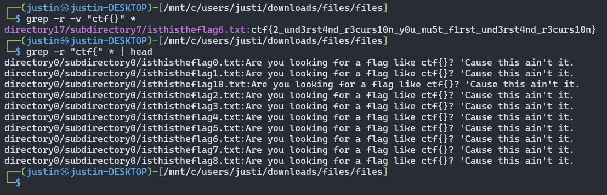

# CLI
**Level**: Medium

**Points**: 267

**Author**: Steve Palica

**Description**:
```markdown
How well do you know command line?

[files.zip]
```

## Writeup
After unzipping the file, multiple folders of folders with multiple files is found. At first inspection, it seems that all the text files contain the same phrase. However, if these text files with the phrase are removed by using a command such as `grep -r -v "ctf{}" *`, the flag is found on a single text file.



**Flag** - `ctf{2_und3rst4nd_r3curs10n_y0u_mu5t_f1rst_und3rst4nd_r3curs10n}`