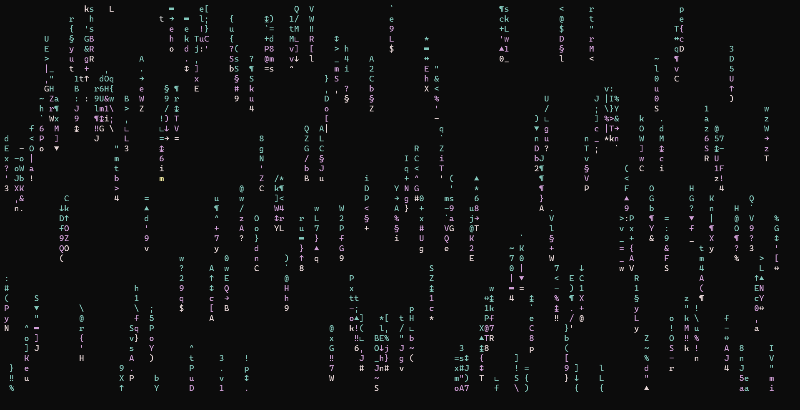
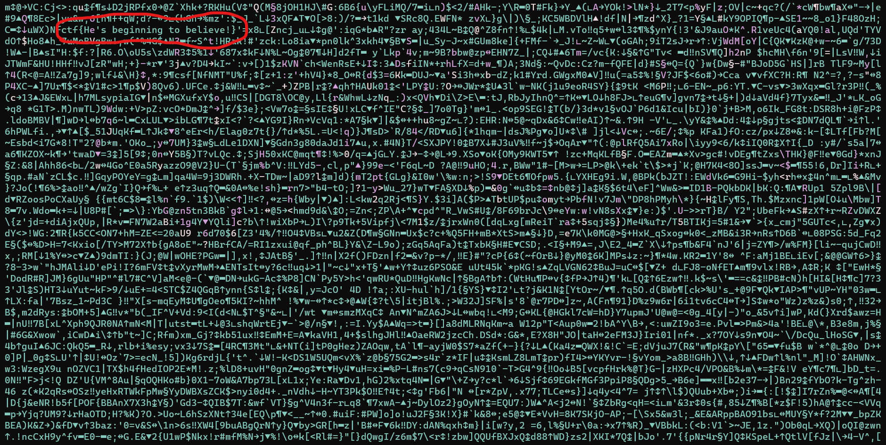

# Powershell 1
**Level**: Medium

**Points**: 489

**Author**: Justin Giboney

**Description**:
```markdown
I have written [some amazing code](https://github.com/JustinApplegate/powershell-fun/blob/main/matrix.ps1), and I think it is trying to tell me something....

*Note - Run it using **PowerShell 7** with a decently sized console, zoomed in a bit for best performance. You may need to copy and paste the code into a text editor to avoid execution policy warnings.*
```

## Writeup
When Powershell 7 is downloaded and runs this file, it seems that text is raining from the sky. However, further inspection of the code reveals that commenting out line 104 will cause the text to stay. After a few seconds, a flag is apparent on the terminal.





**Flag** - `ctf{He's beginning to believe!}`