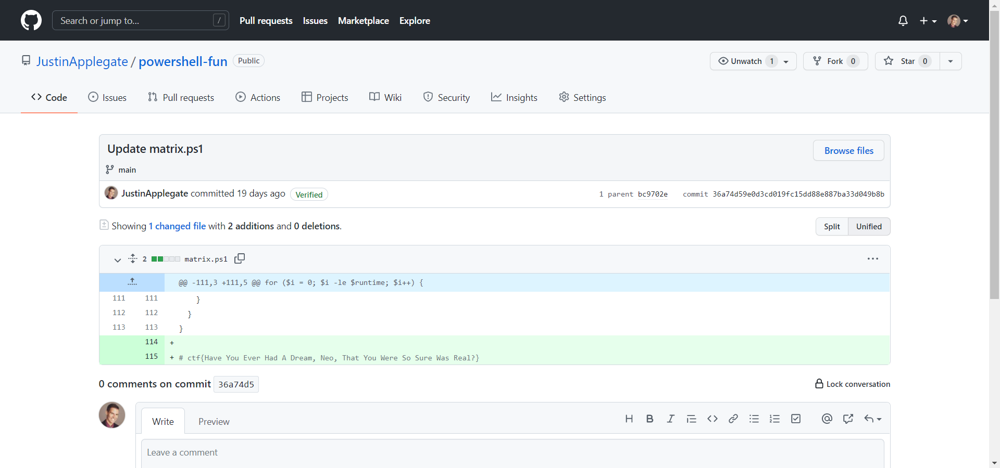

# Powershell 2
**Level**: Easy

**Points**: 465

**Author**: Justin Giboney

**Description**:
```
I hope there isn't something important left in all my changes.... (see script from Powershell 1)
```

## Writeup
Looking at the [commit history for the GitHub repository](https://github.com/JustinApplegate/powershell-fun/commit/36a74d59e0d3cd019fc15dd88e887ba33d049b8b#diff-dace9727a19f2f4d526eb5ceb0bfef48d07390388606ecf8e5db6c3606e58f64) will reveal a flag that was added and later removed.



**Flag** - `ctf{Have You Ever Had A Dream, Neo, That You Were So Sure Was Real?}`