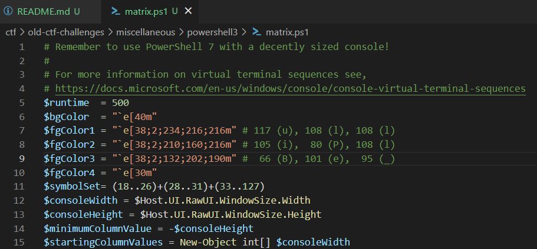

# Powershell 3
**Level**: Medium

**Points**: 500

**Author**: Justin Giboney

**Description**:
```
Maybe I shouldn't have multiplied the colors by 2. They seem a little bright... (see script from Powershell 1)

Flag format - `ctf{Aaaa_Aaaa}`
```

## Writeup
Lines 7-9 of the Powershell script define the different colors used for the raining text. If each of the 3 numbers on the right of each row is divided by 2 and then [converted to ASCII from decimal](https://www.asciitable.com/), the letters are an anagram for the flag.



**Flag** - `ctf{Blue_Pill}`