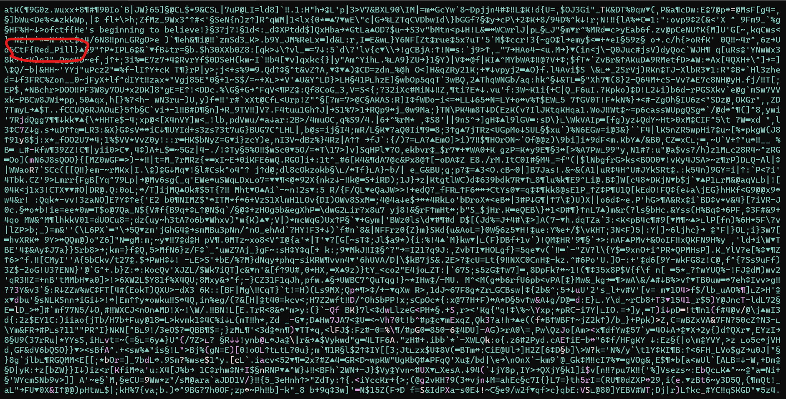

# Powershell 4
**Level**: Extreme

**Points**: 500

**Author**: Justin Giboney

**Description**:
```
I saved my own message in the matrix. But you need to get the columns lined up. The first 15 are: 

`-20, 11, -26, 76, 29, -25, -229, -18, -195, -25, -31, -172, -10, -11, -111, 14`

Be patient!! Flag is case insensitive.
```

## Writeup
Each of the randomly-generated characters are based on seeds. If the seeds are changed to the values specified in the description, eventually another flag will appear. The seeds can be changed by adding these lines of code under line 19:

```powershell
$startingColumnValues[0] = -20
$startingColumnValues[1] =  11
$startingColumnValues[2] = -26
$startingColumnValues[3] =  76
$startingColumnValues[4] =  29
$startingColumnValues[5] = -25
$startingColumnValues[6] = -229
$startingColumnValues[7] = -18
$startingColumnValues[8] = -195
$startingColumnValues[9] = -25
$startingColumnValues[10] = -31
$startingColumnValues[11] = -172
$startingColumnValues[12] = -10
$startingColumnValues[13] = -11
$startingColumnValues[14] = -111
$startingColumnValues[15] = 14
$columnValues[0] = -20
$columnValues[1] =  11
$columnValues[2] = -26
$columnValues[3] =  76
$columnValues[4] =  29
$columnValues[5] = -25
$columnValues[6] = -229
$columnValues[7] = -18
$columnValues[8] = -195
$columnValues[9] = -25
$columnValues[10] = -31
$columnValues[11] = -172
$columnValues[12] = -10
$columnValues[13] = -11
$columnValues[14] = -111
$columnValues[15] = 14
```



**Flag** - `ctf{Red_Pill}`