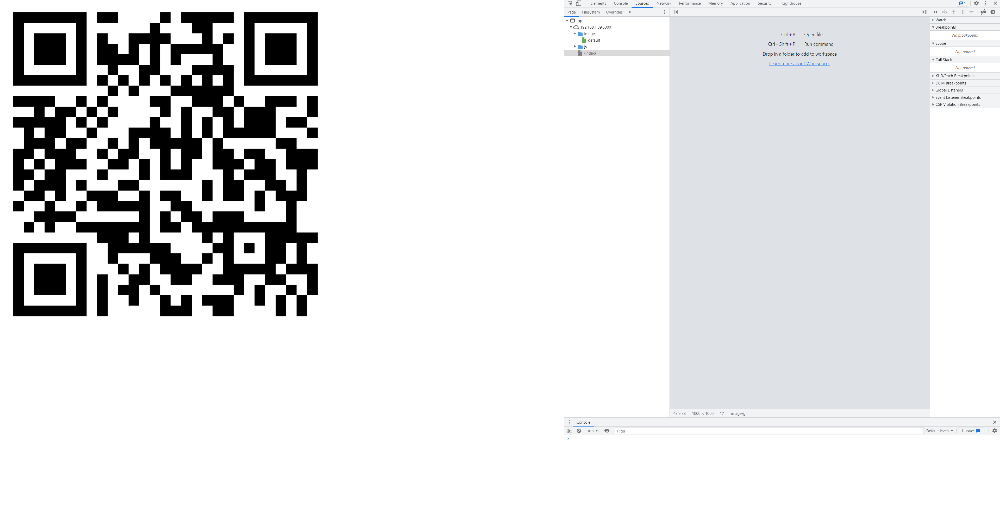

# Windows XP
Level: Medium

Description:
```
Steve did it

`http://byuctf.xyz:40016`
```

## Writeup
This challenge is a relatively straightforward reverse engineering challenge. While the unmodified source code is lost due to a board failure in my computer, the functionality is fairly straightforward. The challenge presents a single QR code (a rickroll). The goal is to retrieve a second QR code which has the flag encoded.

### The Backend
The backend of this challenge is nothing special, just a single endpoint which serves HTML, Javascript, and image files. The endpoint that actually matters is this:

```python
    app.route('/images/<image>')
    def get_image(image):
        if request.args.get('flag') == 'steve is so cool':
            return send_file('images/flag.png', mimetype='image/gif')
        return send_file('images/normal.png', mimetype='image/gif')
```

### The Solution
The only way to retreive the image with the flag is by sending a web request with the 'flag' argument set to 'steve is so cool' (That was originally just a placeholder, but like I said, the original source for the frontend was lost).

### The Frontend
The frontend is a fairly simple bit of JavaScript that has been obfuscated. In essence, there is a function to modify the body of the HTML to contain a QR code. This function is run whenever the page is loaded or resized. If the window is over 150px taller than it is wide, it will send the request with the query string set to retreive the flag image instead of the rickroll.

### How to Find the Solution
While there is only one way to retreive the flag, there are many ways of figuring out what to do. A few are listed:

1. The first (and quickest) solve when playtesting this challenge was done on a cell phone. Since the phone screen was taller than it was wide, the flag was the first image to appear. The solver did have to borrow a second phone to scan the QR code though.
2. Another quick solve during playtesting was done by a web developer who keeps her browsers dev tools expanded out pretty far. She noticed that a second file had been sent, though she had to open that image in a new tab since the dev tools covered a portion of the QR code. Be careful using this method, the governor of Missouri might prosecute you for hacking. 
3. There are some hints as to the nature of what the JavaScript does in the obfuscated version. Particularly, the keywords "getResolution()", "innerHeight", "onresize", and "innerWidth". Playing around with resizing the window would likely give the correct code, though you need to pay attention to resources loaded. I saw one person in playtesting get the flag sent to their browser, but didn't notice, and loaded the rickroll again when they changed the window size again. A packet capture would also work here, though I haven't seen anyone use that method.
4. You could completely deobfuscate the code. This is a little shorter than most JavaScript obfuscation challenges that I've seen, so it should be a lot simpler as well. 
5. If you figure out the "steve is so cool" string and where it goes, you can just directly load the image without messing with window sizing.

## Conclusion
There are many ways of solving this problem. Some are quite simple, and could be done accidentally, and the others are much more involved. In testing, it was fairly divisive on how difficult it was based on which method was used to solve it.

Incidentally, the title of the challenge, Windows XP is a slight hint that the challenge has something to do with the window size.

Here is the unsolved version:



And here is the solved version:


Note that these screenshots were done at a 4k resolution, so they can be much more square than a lower resolution monitor.

**Flag** - `byuctf{size_matters_not_look_at_me}`