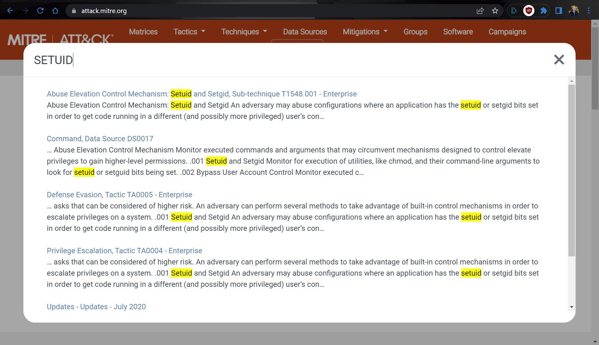

# Mitre Attack Threat Intel Challenges
## Challenge # 1 Easy
What type of applications are targeted as a part of T1190?

flag format: byuctf{TYPE}
```
Flag: byuctf{Public-Facing}
Search T1190 on Mitre Att&CK, find:
https://attack.mitre.org/techniques/T1190/
```
## Challenge # 2 Easy
Under the tecnique from Challenge #1, is a group that has leveraged said technique in abuse of a vulnerability within ASP.NET AJAX. What crypto currency is this particular APT correlated and what is their group id #?

flag format: byuctf{crpyto_groupID}.
```
flag: byuctf{monero_g0108}
Searching for ASP Net Ajax leads to the Blue Mockingbird group page.
https://attack.mitre.org/groups/G0108/
Within the group's summary on that page, you can read that they are correlated with monero cryptocurrency mining payloads. THe Group number can be read in either the URL or the ID information box.
```

## Challenge # 3 Medium
The following command can be used to determine if a file is vulnerable to be leveraged in this attack. 

```find / -perm +4000 2>/dev/null```

What is the attack Technique # including the subtecnique?

format: byuctf{T9999.99999}
```
flag: byuctf{T1548.001}
The above command involves file permissions at first glance. When looking closer, it is identifying any file with the setuid bit engaged on a file.
If you search MITRE ATT&CK for Setuid, you get the following result.

The top one is the correct answer.
https://attack.mitre.org/techniques/T1548/001/
```



## Challenge # 4 Medium
IOCs are Indicators of Compromise. They are the currency of Threat intelligence. 
Can you find a specific IOC from activity generated by the group STATIC Kitten, aka Muddy Water?
This specific indicator of compromise has two countries names within the domain. 
The IOC was also mentioned in a recent report by TrendMicro in 2019.

flag format: byuctf{hostname}
for example: byuctf{www.Australia-Japan.org}
```

flag: byuctf{www.latvia-usa.org}
STATIC kitten is also known as Muddy Water. 
https://attack.mitre.org/groups/G0069/

If you google: ioc muddy water
It brings up as the first result: 
https://otx.alienvault.com/pulse/5d003085b7ce3f2b77773a6d/
Expanding the list of IOCs to inlcude hostnames lists: 
www.latvia-usa.org as the second host name.
If you look up through TrendMicro: 
https://documents.trendmicro.com/assets/white_papers/wp_new_muddywater_findings_uncovered.pdf
```


